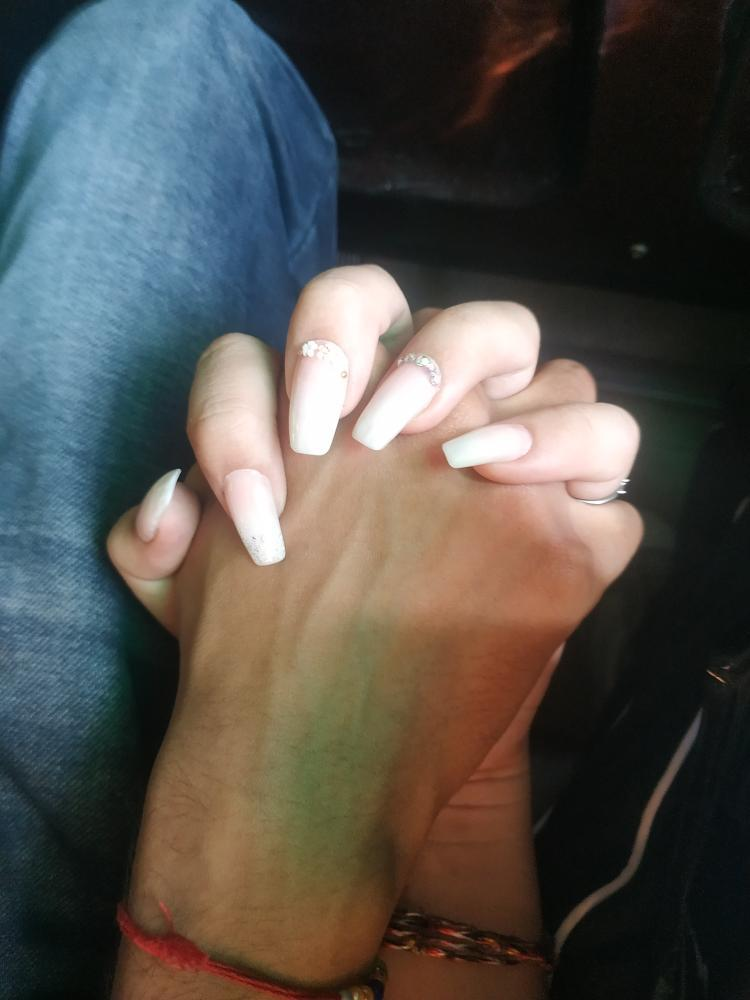
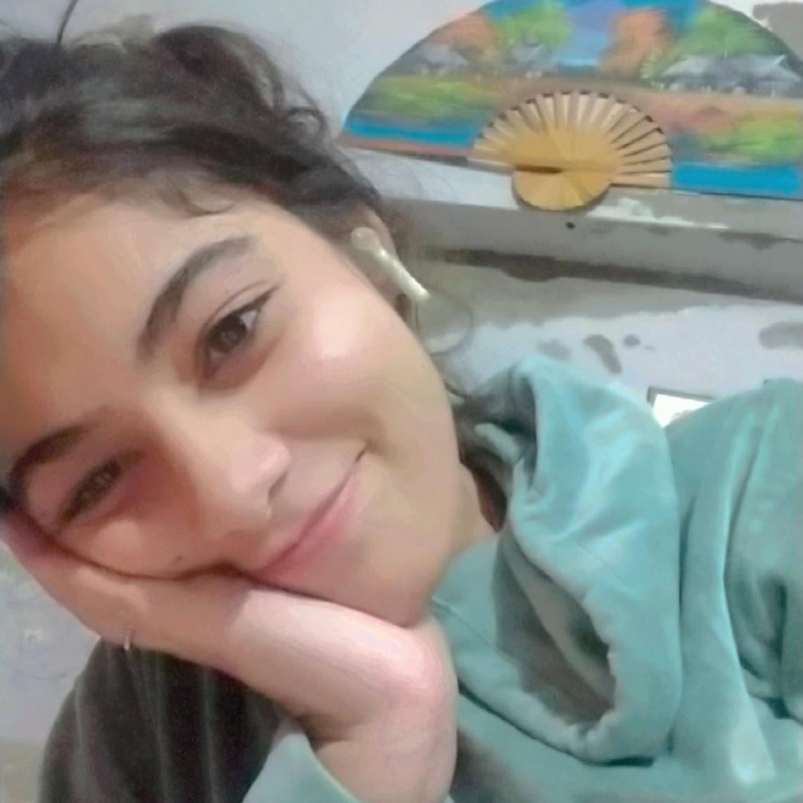

<html lang="en">
<head>
    <meta charset="UTF-8">
    <meta name="viewport" content="width=device-width, initial-scale=1.0">
    <title>Happy Birthday Vishali</title>
    
</head>
<body>
    <header>
        <h1>Happy Birthday Vishi!!</h1>
        <h2>I just LOVE u so MUCH!!</h2>
        <h3>Having trouble finding? Try clicking randomly:)</h3>
    </header>

    <section id="memories" class="hidden">
        <h2 style="text-align: center; margin-bottom: 20px; color: #444;">Our Best Memories</h2>
        

            

            

        

    </section>

    <section id="gallery" class="hidden">
        <h2 style="text-align: center; margin-bottom: 20px; color: #444;">My Cute Baby</h2>
        

            

            

            

        

    </section>
<section id="video" class="hidden">
    <h2 style="text-align: center; margin-bottom: 20px; color: #444;">This Weird thing too ;)</h2>
    <video controls width="80%" style="display: block; margin: 0 auto; border-radius: 10px; box-shadow: 0 4px 15px rgba(0, 0, 0, 0.2);">
        <source src="lv_0_20241218234044.mp4" type="video/mp4">
        Your browser does not support the video tag.
    </video>
</section>
<section>
  <h3>Let this day of your life began with the blessings of our god...Jai Shree Krishna. Happy Birthday sweetheart:) I know I could have done a lot better than this, but you know that I am still learning. I will try to make better things next time for you baby. I hope this day gives you a new kick start and you achieve all the things that you want in life. I want all the problems to vanish away from your life and you always stay happy. I want us to be together like this throughout our entire life. Don't worry, everything will go absolutely fine and better because now my baby is strong right. Vishali, I love you so much. No matter what me and god will always stay by your side. I wish you a very Happy Birthday again. Happy Life ahead :)</h3>
</section>
    
</body>
</html>
